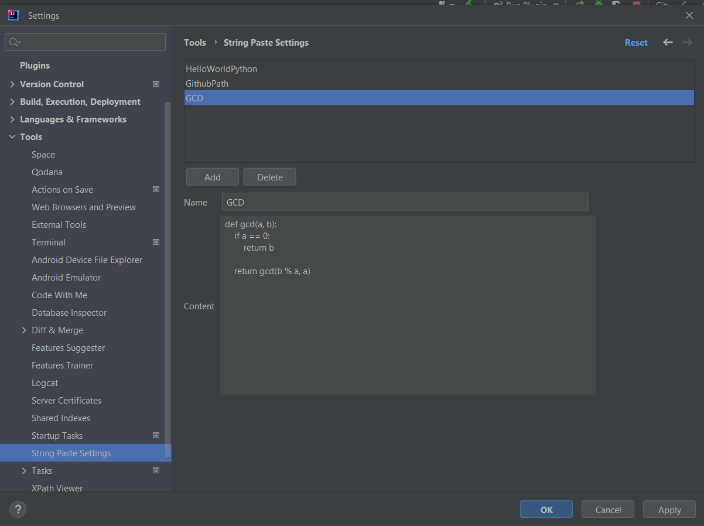
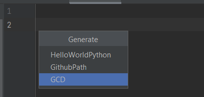
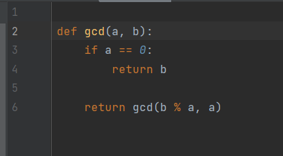

# String Paste Plugin 

The String Paste plugin simplifies incorporating frequently used strings into your code.
With this tool, users can effortlessly define multiple strings and seamlessly paste them
into their codebase as needed. 
Say goodbye to repetitive typing and hello to enhanced efficiency in your coding workflow.

<a href="https://plugins.jetbrains.com/plugin/23982-string-paste/">**GET PLUGIN**</a>

Example of usage:
- Store your often used URLs / paths
- Description templates
- Frequently used method
- many more

## How to Use
### Settings

1. Open Settings (*File* -> *Settings*)
2. Click on *Tools* -> String Paste Settings
3. Click on *Add* and enter name and content
4. Click on *Apply*

### Pasting

1. Open Generate pop up. (Alt + Insert) or 
   Right click on editor and Generate 
2. Select String

3. Enjoy :)